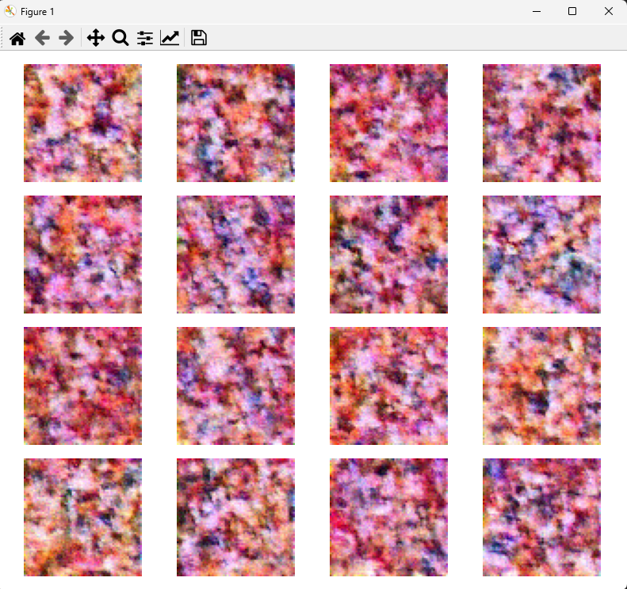
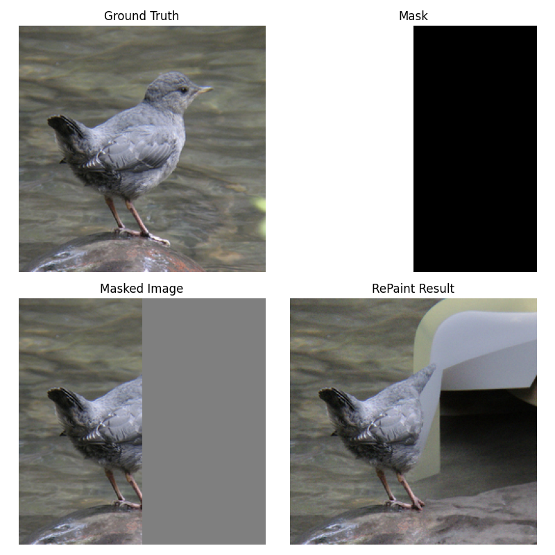
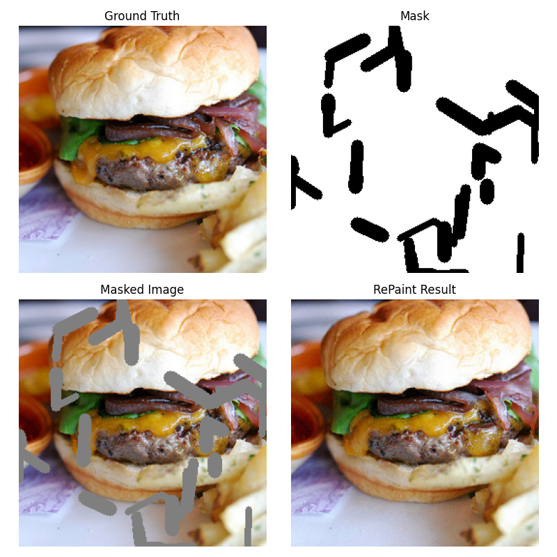
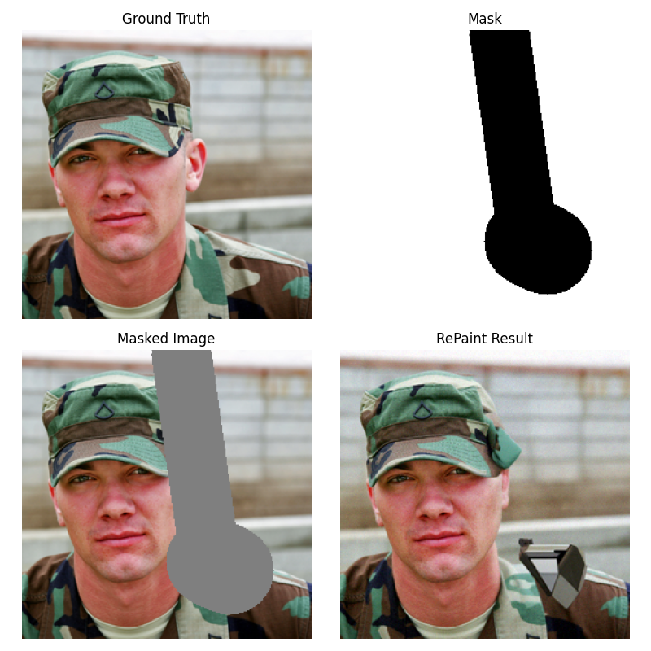
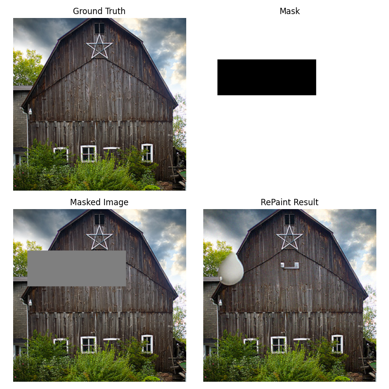

# Diffusion Models and Image Inpainting — DDPM & RePaint

This repository contains two phases:

1. **Phase 1:** PyTorch implementation of **Denoising Diffusion Probabilistic Models (DDPM)** trained on **CelebA 64×64** images from scratch.
2. **Phase 2:** **Diffusion-based image inpainting using the RePaint algorithm**, with working code and sample outputs.

The goal is to **understand diffusion-based generative modeling** and apply it to **practical image inpainting tasks**.

---

## Project Motivation

Diffusion models are powerful generative models that **learn to reverse a gradual noise corruption process**.

This repository explores:

- **Phase 1:** DDPM training from scratch
- **Phase 2:** Image inpainting using RePaint with masked inputs

Applications include image restoration, conditional generation, and experimentation with diffusion resampling strategies.

---

## Phase 1 — DDPM Implementation

### Components

**Diffusion Process**

Forward diffusion adds Gaussian noise:

$$x_t = \sqrt{\bar{\alpha}_t}\, x_0 + \sqrt{1 - \bar{\alpha}_t}\, \epsilon$$

- $x_0$ — original image
- $x_t$ — noisy image at timestep $t$
- $\epsilon$ — Gaussian noise

**UNet Noise Predictor**

- Encoder–decoder backbone with skip connections
- Residual blocks and GroupNorm
- Self-attention in bottleneck
- Predicts noise $\epsilon_\theta(x_t, t)$ using **MSE loss**

**Training Pipeline**

1. Sample image $x_0$ from CelebA
2. Random timestep $t$
3. Add noise with forward diffusion
4. Predict noise using UNet
5. Minimize $L = \|\epsilon - \epsilon_\theta(x_t, t)\|^2$

**Sampling**

Generates images by **iterative denoising from random noise**.

### Phase 1 Results

<p align="center">
  
</p>

Intermediate outputs show abstract patterns before the model learns the full image distribution.

---

## Phase 2 — RePaint Simplified Inpainting

Phase 2 builds on Phase 1 using **pretrained diffusion models** for **image inpainting**.

### Features

- Fills **masked regions** in images
- Uses **resampling during reverse diffusion** for improved quality
- Code in `repaint_simplified/`
- Masks in `repaint_simplified/data/masks/`
- Pretrained weights folder is a placeholder (`.gitkeep`)

### Running Inpainting

```bash
python repaint_simplified/sample_repaint.py
```

Results are saved in `repaint_simplified/assets/`.

### Phase 2 Results

<p align="center">
  
  
  
  
  
  
  
</p>

These images show how masked regions are filled using RePaint while preserving surrounding structure.

---

## Repository Structure

```
.
├── diffusion/           # DDPM forward/reverse diffusion code
├── models/              # UNet architecture
├── utils/               # Dataset loader
├── train.py             # Phase 1 training
├── sample.py            # Phase 1 sampling
├── celeba_download.py   # Download CelebA dataset
├── checkpoints/         # placeholder for model checkpoints
├── data/                # placeholder for dataset
├── assets/              # Phase 1 & Phase 2 outputs
└── repaint_simplified/  # Phase 2 RePaint code
```

---

## Dataset

- **Phase 1:** CelebA 64×64
- **Phase 2:** Any images with masks in `repaint_simplified/data/masks/`

Download CelebA:

```bash
python celeba_download.py
```

---

## Dependencies & Training

Install dependencies:

```bash
pip install -r requirements.txt
```

Phase 1 training:

```bash
python train.py
```

Phase 2 inpainting:

```bash
python repaint_simplified/sample_repaint.py
```

---

## Next Steps

- Extend RePaint to higher resolution images
- Experiment with different mask types
- Integrate into real-world image restoration tasks

---

## Related Work

- [Denoising Diffusion Probabilistic Models (DDPM)](https://arxiv.org/abs/2006.11239)
- [Improved DDPM](https://arxiv.org/abs/2102.09672)
- [RePaint: Inpainting using Denoising Diffusion Models](https://arxiv.org/abs/2201.09865)

---

## Author

Independent exploration of diffusion-based generative modeling and image inpainting using PyTorch.